# Component Dependency Graph

## Visual Dependency Tree

```mermaid
graph TD
    subgraph "ag-grid-react-components"
        Index[index.ts]

        subgraph "Components"
            DF[DateFilter]
            QFD[QuickFilterDropdown]
            AF[ActiveFilters]
        end

        subgraph "DateFilter Sub-components"
            FMT[FilterModeToggle]
            FTS[FilterTypeSelector]
            FA[FilterActions]
            ADP[AbsoluteDatePicker]
            REI[RelativeExpressionInput]
            TDI[TextDateInput]
        end

        subgraph "Utilities"
            DEP[dateExpressionParser]
            FSU[filterStateUtils]
            GSU[gridStateUtils]
            LOG[logger]
        end

        subgraph "Hooks"
            UFS[useFilterState]
            UFV[useFilterValidation]
            UD[useDebounce]
            UDV[useDebouncedValidation]
        end
    end

    subgraph "External Dependencies"
        React[react]
        ReactDOM[react-dom]
        AGGrid[ag-grid-community]
        AGReact[ag-grid-react]
        DateFNS[date-fns]
        ReactDP[react-datepicker]
        LZString[lz-string]
    end

    subgraph "CSS Dependencies"
        GlobalCSS[styles.css]
        DFCSS[DateFilter.module.css]
        QFDCSS[QuickFilter.module.css]
        AFCSS[ActiveFilters.module.css]
        DICSS[DateInputs.module.css]
        FACSS[FilterActions.module.css]
        FTSCSS[FilterTypeSelector.module.css]
        FMTCSS[FilterModeToggle.module.css]
        DPCSS[react-datepicker.css]
    end

    %% Main component dependencies
    Index --> DF
    Index --> QFD
    Index --> AF
    Index --> DEP
    Index --> FSU
    Index --> GSU
    Index --> GlobalCSS

    %% DateFilter dependencies
    DF --> React
    DF --> AGReact
    DF --> AGGrid
    DF --> DateFNS
    DF --> FMT
    DF --> FTS
    DF --> FA
    DF --> ADP
    DF --> REI
    DF --> TDI
    DF --> UFS
    DF --> UFV
    DF --> LOG
    DF --> DFCSS

    %% DateFilter sub-component dependencies
    ADP --> React
    ADP --> ReactDP
    ADP --> DICSS
    ADP --> DPCSS

    REI --> React
    REI --> DICSS

    TDI --> React
    TDI --> DateFNS
    TDI --> DICSS

    FMT --> React
    FMT --> FMTCSS

    FTS --> React
    FTS --> FTSCSS

    FA --> React
    FA --> FACSS

    %% QuickFilterDropdown dependencies
    QFD --> React
    QFD --> ReactDOM
    QFD --> QFDCSS

    %% ActiveFilters dependencies
    AF --> React
    AF --> AGGrid
    AF --> AFCSS

    %% Utility dependencies
    DEP --> DateFNS
    FSU --> AGGrid
    FSU --> LOG
    GSU --> AGGrid
    GSU --> LZString
    GSU --> FSU
    GSU --> LOG

    %% Hook dependencies
    UFS --> React
    UFV --> React
    UFV --> DEP
    UD --> React
    UDV --> React
    UDV --> UD

    %% Style dependency annotations
    style ReactDP fill:#ff9999
    style LZString fill:#ffcc99
    style ReactDOM fill:#ffffcc
    style DPCSS fill:#ff9999

    classDef essential fill:#90EE90
    classDef removable fill:#ff9999
    classDef optional fill:#ffcc99
    classDef internal fill:#lightblue

    class React,AGGrid,AGReact,DateFNS essential
    class ReactDP removable
    class LZString,ReactDOM optional
    class DF,QFD,AF,DEP,FSU,GSU,LOG,UFS,UFV,UD,UDV internal
```

## Dependency Categories

### 🟢 Essential (Green)

Dependencies that cannot be removed without breaking core functionality:

- **react**: Core framework for all components
- **ag-grid-community**: Grid API and types
- **ag-grid-react**: React integration (useGridFilter hook)
- **date-fns**: Date manipulation throughout the library

### 🔴 Removable/Injectable (Red)

Dependencies that could be made optional or injectable:

- **react-datepicker**: Only used in AbsoluteDatePicker component
  - Adds ~100KB to bundle
  - Could use native HTML5 date inputs
  - Could allow custom date picker injection

### 🟡 Optional (Yellow)

Dependencies already optional based on usage:

- **react-dom**: Only needed for portal rendering in QuickFilterDropdown
- **lz-string**: Only used for URL compression in gridStateUtils
  - Could work without compression (longer URLs)
  - Could allow custom compression function

### 🔵 Internal (Blue)

Internal modules and components within the library

## Impact Analysis

### Removing react-datepicker

- **Savings**: ~100KB (~31% of ES bundle)
- **Impact**: Need alternative for date selection
- **Options**:
  1. Use native `<input type="date">`
  2. Allow DatePickerComponent prop injection
  3. Create lightweight custom date picker

### Making lz-string optional

- **Savings**: ~15KB (~5% of ES bundle)
- **Impact**: Longer URLs when persisting state
- **Options**:
  1. Make compression opt-in
  2. Allow custom compression function
  3. Use shorter state keys

### CSS Optimization

- **Current**: 48KB CSS (7.5KB gzipped)
- **Options**:
  1. Separate CSS bundles per component
  2. CSS-in-JS for zero-config
  3. Headless/unstyled components

## Modularization Priority

1. **High Priority**: Remove react-datepicker dependency

   - Biggest impact on bundle size
   - Limited usage (one component)
   - Good alternatives available

2. **Medium Priority**: Make lz-string optional

   - Moderate bundle impact
   - Already isolated to one utility
   - Easy to make configurable

3. **Low Priority**: Split CSS modules
   - Small impact on bundle size
   - CSS already well-organized
   - Would complicate usage
