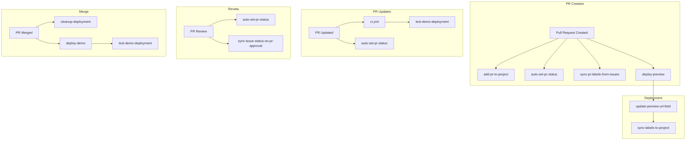

# GitHub Workflows Reference

This document provides comprehensive documentation for all GitHub Actions workflows in the repository. Workflows are organized by category for easier navigation.

## Table of Contents

1. [Project Management Workflows](#project-management-workflows)
2. [CI/CD Workflows](#cicd-workflows)
3. [Deployment Workflows](#deployment-workflows)
4. [Synchronization Workflows](#synchronization-workflows)
5. [Release Workflows](#release-workflows)
6. [Workflow Dependencies](#workflow-dependencies)
7. [Troubleshooting](#troubleshooting)

---

## Project Management Workflows

### 📋 add-pr-to-project.yml

**Purpose**: Automatically adds newly created pull requests to the GitHub project board.

**Triggers**:

- `pull_request`: `opened`, `reopened`

**Key Features**:

- Adds PR to "AG Grid React Components Roadmap" project
- Sets initial status based on PR state
- Works with both user and repository projects

**Configuration**:

```yaml
PROJECT_ID: PVT_kwHOBMT9Es4Aqh-F # Hardcoded project ID
```

**Dependencies**: None

---

### 🏷️ auto-set-pr-status.yml

**Purpose**: Automatically updates PR status labels based on review state and approval status.

**Triggers**:

- `pull_request`: `opened`, `ready_for_review`, `converted_to_draft`
- `pull_request_review`: `submitted`, `dismissed`

**Label States**:

- `status: pr-in-progress` - Draft PRs
- `status: in-code-review` - Ready for review
- `status: code-review-complete` - Approved
- `status: merged` - After merge

**Configuration**: Uses repository's default labels

**Dependencies**: Project sync workflows

---

### 🔄 sync-pr-labels-from-issues.yml

**Purpose**: Automatically copies labels from linked issues to pull requests.

**Triggers**:

- `pull_request`: `opened`, `edited`

**Key Features**:

- Detects issue links in PR body (fixes #123, closes #123, etc.)
- Copies all labels except status labels
- Supports multiple linked issues
- Works with full GitHub URLs

**Excluded Labels**: Status labels (they're managed separately)

**Dependencies**: None

---

### ✅ sync-issue-status-on-pr-approval.yml

**Purpose**: Updates linked issue status when PR is approved.

**Triggers**:

- `pull_request_review`: `submitted`

**Status Updates**:

- When PR approved → Issue status: `status: in-product-review`
- Adds comment to issue noting approval

**Dependencies**:

- Project must have status field
- Issue must be in project

---

## CI/CD Workflows

### 🧪 ci.yml

**Purpose**: Main continuous integration pipeline for quality checks.

**Triggers**:

- `push`: to main branch
- `pull_request`: all events

**Jobs**:

1. **Quality Checks** (parallel):

   - Format check
   - Lint check
   - Type check
   - Unit tests with coverage
   - Build library
   - Build demo

2. **E2E Tests**:
   - Runs after quality checks
   - Uses Playwright
   - Tests demo application

**Key Features**:

- Parallel job execution
- Caching for dependencies
- Coverage reporting
- Artifact uploads for failures

**Configuration**:

```yaml
node-version: 20
coverage-threshold: 80%
```

---

### 🎯 test-demo-deployment.yml

**Purpose**: Tests demo deployments are working correctly.

**Triggers**:

- `workflow_dispatch`: Manual
- `schedule`: Daily at midnight UTC
- `workflow_run`: After demo deployments

**Test Scenarios**:

- Production demo health check
- Component functionality tests
- Performance metrics
- Accessibility checks

**Dependencies**: Demo deployment must be live

---

### ✨ auto-fix-whitespace.yml

**Purpose**: Automatically fixes whitespace issues in pull requests.

**Triggers**:

- `issue_comment`: Created on PRs with `/fix whitespace` comment

**Key Features**:

- Runs whitespace fixer script
- Commits changes if any
- Updates PR with status

**Permissions Required**:

- `contents: write`
- `pull-requests: write`

---

## Deployment Workflows

### 🚀 deploy-demo.yml

**Purpose**: Deploys the main demo application to production.

**Triggers**:

- `push`: to main branch
- `workflow_dispatch`: Manual with path override

**Deployment Process**:

1. Build demo application
2. Generate version info
3. Deploy to Cloudflare Pages
4. Update demo router
5. Deploy API worker

**Environment**:

- URL: [https://demo.rozich.net/ag-grid-react-components/](https://demo.rozich.net/ag-grid-react-components/)
- Platform: Cloudflare Pages + Workers

**Secrets Required**:

- `CLOUDFLARE_API_TOKEN`
- `CLOUDFLARE_ACCOUNT_ID`
- `CLOUDFLARE_KV_NAMESPACE_ID`

---

### 🔍 deploy-preview.yml

**Purpose**: Smart preview deployments with path filtering and manual control.

**Triggers**:

- `pull_request`: `opened`, `synchronize`, `labeled`
- Only when relevant files change

**Path Filters**:

- `src/components/**`
- `src/demo/**`
- `api/**`
- `package.json`
- Configuration files

**Label Controls**:

- `deploy-preview` - Force deployment
- `skip-preview` - Skip deployment
- `has-preview` - Added after deployment

**Key Features**:

- Creates isolated preview environment
- Unique URL per PR: `https://demo.rozich.net/ag-grid-react-components-pr-{number}/`
- Fork detection (no auto-deploy for forks)
- Manual override via labels
- Deployment testing
- Preview URL in PR comment
- Updates project board with preview URL

**Note**: This workflow consolidates the previous `deploy-demo-preview.yml` and `deploy-demo-preview-smart.yml`

---

### 🎛️ manual-preview-control.yml

**Purpose**: Provides slash commands for manual preview control.

**Triggers**:

- `issue_comment`: Created on PRs

**Commands**:

- `/deploy preview` - Force preview deployment
- `/skip preview` - Add skip label
- `/destroy preview` - Remove preview

**Dependencies**: Works with `deploy-preview.yml` workflow

---

### 🧹 cleanup-deployment.yml

**Purpose**: Comprehensive cleanup of PR preview resources when merged.

**Triggers**:

- `pull_request`: `closed` (when merged)

**Cleanup Actions**:

1. Delete API Worker (via Cloudflare API)
2. Remove KV metadata
3. Clean R2 storage (prefers AWS CLI if credentials available, falls back to Wrangler)
4. Clear Preview URL in project board
5. Remove `has-preview` label
6. Post cleanup comment

**Secrets Required**:

- `CLOUDFLARE_API_TOKEN`
- `CLOUDFLARE_ACCOUNT_ID`
- `CLOUDFLARE_KV_NAMESPACE_ID`
- `CLOUDFLARE_R2_ACCESS_KEY_ID` (optional, for efficient R2 cleanup)
- `CLOUDFLARE_R2_SECRET_ACCESS_KEY` (optional, for efficient R2 cleanup)

**Note**: This workflow consolidates the previous `cleanup-pr-deployment.yml` and `cleanup-pr-preview.yml`

---

### 🔗 update-preview-url-field.yml

**Purpose**: Updates Preview URL field in GitHub Projects.

**Triggers**:

- `workflow_run`: After preview deployment
- `pull_request`: `closed`

**Actions**:

- Sets Preview URL after deployment
- Clears URL when PR closed
- Removes `has-preview` label on close

**Dependencies**: Project must have "Preview URL" text field

---

## Synchronization Workflows

### 🔄 sync-labels-to-project.yml

**Purpose**: Syncs GitHub labels to project board fields.

**Triggers**:

- `issues`: `opened`, `labeled`, `unlabeled`
- `pull_request`: `opened`, `labeled`, `unlabeled`

**Synced Fields**:

- Priority (from priority labels)
- Area (from area labels)
- Type (from type labels)
- Status (from status labels)

**Direction**: Labels → Project Fields

---

### 🔄 sync-project-to-labels.yml

**Purpose**: Syncs project board fields back to GitHub labels.

**Triggers**:

- `workflow_dispatch`: Manual with issue number

**Key Features**:

- Prevents sync loops with other workflows
- Updates multiple label categories
- Handles label removal

**Direction**: Project Fields → Labels

---

## Release Workflows

### 📦 release.yml

**Purpose**: Manual release workflow with full control.

**Triggers**:

- `workflow_dispatch`: Manual with inputs

**Inputs**:

- `dry_run`: Test without publishing
- `skip_tests`: Skip test suite
- `npm_tag`: NPM dist tag (latest, beta, etc.)

**Release Process**:

1. Checkout and setup
2. Run tests (unless skipped)
3. Build library
4. Bump version
5. Create git tag
6. Publish to NPM
7. Create GitHub release

**Outputs**: Published package and GitHub release

---

### 🚀 release-on-push.yml

**Purpose**: Automated releases when pushing to main.

**Triggers**:

- `push`: to main branch with `[release]` in commit message

**Key Features**:

- Triggered by commit message
- Fully automated process
- Creates changelog
- Posts release announcement

**Example Commit**: `feat: add new feature [release]`

---

### 📚 publish.yml

**Purpose**: Publishes package to NPM after release.

**Triggers**:

- `release`: `published`

**Process**:

1. Verify release tag format
2. Checkout tag
3. Build package
4. Publish to NPM

**Validation**: Only runs for valid semver tags

**Secrets Required**: `NPM_TOKEN`

---

## Workflow Dependencies

### Dependency Graph



### Critical Paths

1. **PR Lifecycle**:

   ```text
   Create PR → Add to Project → Set Status → Deploy Preview → Update URL → Review → Merge → Cleanup
   ```

2. **Release Path**:

   ```text
   Push to Main → CI Passes → Manual Release → Publish NPM → Create GitHub Release
   ```

3. **Sync Loop**:
   ```text
   Labels Change → Update Project → Project Change → Update Labels
   ```

---

## Troubleshooting

### Common Issues

#### Preview Not Deploying

1. Check if paths match filters in `deploy-demo-preview-smart.yml`
2. Verify PR is not from a fork (or add `deploy-preview` label)
3. Check Cloudflare secrets are set
4. Look for `skip-preview` label

#### CI Failures

1. Run `npm run pre-commit` locally
2. Check Node version matches CI (v20)
3. Verify all dependencies installed
4. Check for flaky tests

#### Sync Issues

1. Ensure project fields match expected names
2. Check for sync loop (multiple updates)
3. Verify GitHub token permissions
4. Check label format matches patterns

#### Cleanup Failures

1. Verify R2 credentials if storage not cleaned
2. Check worker exists before deletion
3. Ensure PR was actually merged
4. Look for manual cleanup scripts

### Debugging Workflows

#### Enable Debug Logging

Add secret: `ACTIONS_RUNNER_DEBUG: true`

#### Check Workflow Runs

````bash
gh run list --workflow=workflow-name.yml
gh run view <run-id>
```text

#### Download Artifacts

```bash
gh run download <run-id>
```text

#### Re-run Failed Jobs

```bash
gh run rerun <run-id> --failed
```text

### Performance Optimization

#### Workflow Concurrency

Add to workflows to prevent duplicate runs:

```yaml
concurrency:
  group: ${{ github.workflow }}-${{ github.ref }}
  cancel-in-progress: true
```text

#### Caching

Ensure dependency caching is used:

```yaml
- uses: actions/setup-node@v4
  with:
    cache: "npm"
```text

#### Path Filtering

Use path filters to skip unnecessary runs:

```yaml
paths:
  - "src/**"
  - "package.json"
````

---

## Maintenance

### Regular Tasks

1. **Weekly**:

   - Review failed workflow runs
   - Check for deprecated actions
   - Update action versions

2. **Monthly**:

   - Audit workflow permissions
   - Review and optimize slow workflows
   - Clean up old workflow runs

3. **Quarterly**:
   - Update Node.js version
   - Review and update secrets
   - Audit workflow usage metrics

### Best Practices

1. **Always use specific action versions** (not @master)
2. **Minimize secret exposure** - use environment variables
3. **Add timeouts** to prevent hung jobs
4. **Use job outputs** instead of artifacts for data passing
5. **Document custom actions** and scripts
6. **Test workflows** in a separate branch first

---

## Related Documentation

- [GitHub Automation Overview](./README.md)
- [Bot Development Guide](./bot-development-guide.md)
- [Maintenance Guide](./maintenance-guide.md)
- [GitHub Actions Documentation](<[https://docs.github.com/action](https://docs.github.com/action)s>)
