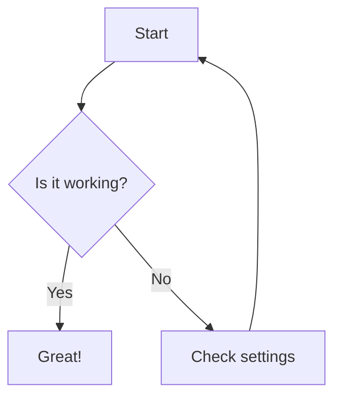

# Fixing Mermaid Diagrams in VS Code

## Quick Fix Solutions

### 1. Install Mermaid Extension

The most common issue is not having a Mermaid preview extension installed. Install one of these:

### Recommended: Markdown Preview Mermaid Support

```text
ext install bierner.markdown-mermaid
```

### Alternative: Mermaid Markdown Syntax Highlighting

```text
ext install bpruitt-goddard.mermaid-markdown-syntax-highlighting
```

### 2. Enable Mermaid in VS Code Settings

1. Open VS Code Settings (Cmd/Ctrl + ,)
2. Search for "mermaid"
3. Ensure these settings are enabled:
   - `markdown.mermaid.enabled`: true
   - `markdown.preview.mermaid.enabled`: true

Or add to your `settings.json`:

```json
{
  "markdown.mermaid.enabled": true,
  "markdown.preview.mermaid.enabled": true
}
```

### 3. Use Enhanced Markdown Preview

Instead of the default preview, try:

- **Markdown Preview Enhanced** extension: `ext install shd101wyy.markdown-preview-enhanced`
- This has built-in Mermaid support

### 4. Check Your Preview Method

Make sure you're using the correct preview:

- Use `Cmd/Ctrl + Shift + V` for Markdown preview
- Or click the preview icon in the top right of the editor

### 5. Alternative: Use Mermaid Live Editor

If VS Code still won't render them, paste the diagrams here:

- [https://mermaid.live/](https://mermaid.live/)

### 6. Verify Diagram Syntax

The diagrams in the README are using correct syntax:

- `graph TB` for top-bottom flowchart
- `graph LR` for left-right flowchart
- Proper subgraph syntax
- Correct arrow notation

### 7. Workspace Trust

If you're in a restricted mode:

1. Check if VS Code shows "Restricted Mode" in the status bar
2. Click it and trust the workspace
3. Reload VS Code

### 8. Try a Different Approach

If none of the above work, you can also:

1. Use GitHub's built-in Mermaid rendering (push and view on GitHub)
2. Use a dedicated Mermaid app
3. Convert to PNG/SVG using Mermaid CLI

## Testing Your Setup

Create a test file `test-mermaid.md` with:

````markdown
# Mermaid Test


````

```text

If this simple diagram doesn't render, the issue is with your VS Code setup, not the diagram syntax.
```
