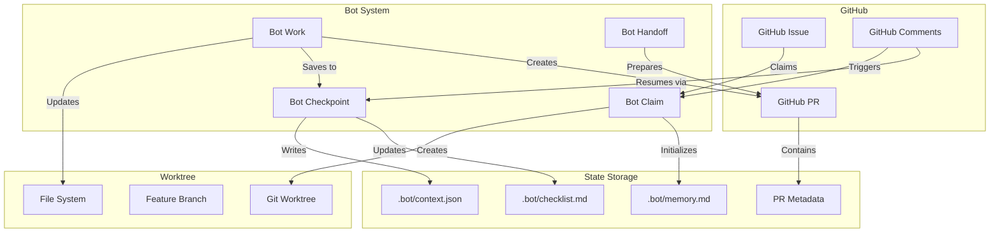
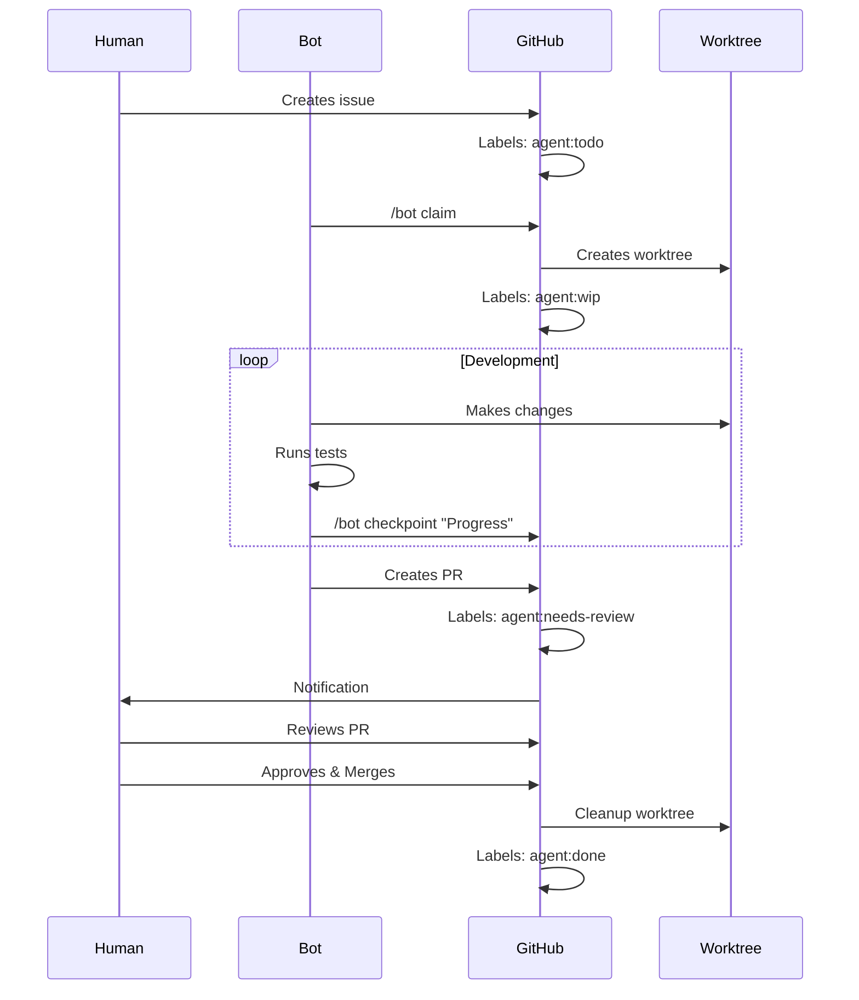
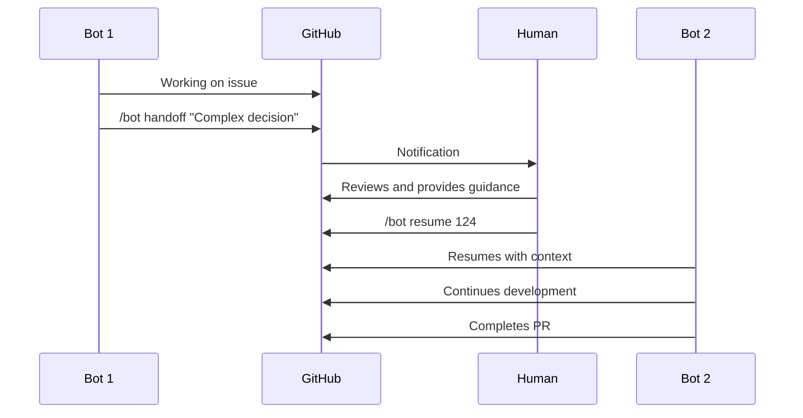
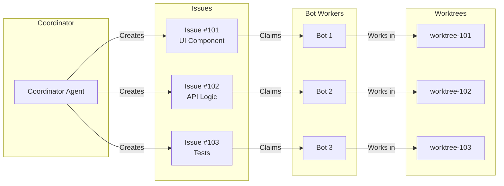

# Bot Development Guide

This guide explains how to use the bot workflow system for automated development with AI agents. The system enables parallel development by multiple agents while maintaining code quality and preventing conflicts.

## Table of Contents

1. [Overview](#overview)
2. [Architecture](#architecture)
3. [Getting Started](#getting-started)
4. [Bot Commands](#bot-commands)
5. [Workflow Patterns](#workflow-patterns)
6. [State Management](#state-management)
7. [Worktree Management](#worktree-management)
8. [Best Practices](#best-practices)
9. [Troubleshooting](#troubleshooting)
10. [Advanced Topics](#advanced-topics)

---

## Overview

The bot workflow system provides a structured way for AI agents to:

- Claim and work on GitHub issues independently
- Save progress with persistent state
- Create pull requests with full context
- Hand off work to humans when needed
- Work in parallel without conflicts

### Key Benefits

- **Parallel Development**: Multiple bots can work simultaneously
- **State Persistence**: Work can be resumed after interruptions
- **Quality Enforcement**: TDD and code standards are maintained
- **Human Oversight**: Clear handoff points for complex decisions
- **Audit Trail**: Complete history of bot actions

---

## Architecture

### System Components



### State Persistence Locations

1. **Issue Comments**: Claim locking and status updates
2. **Feature Branch**: Code changes and commits
3. **`.bot/` Directory**: Working state and memory
4. **PR Description**: YAML frontmatter with metadata
5. **GitHub Labels**: Visual state indicators

---

## Getting Started

### Prerequisites

1. **Environment Setup**:

   ```bash
   # Required environment variables
   export GITHUB_TOKEN=your_token
   export BOT_WORKSPACE_DIR=~/ag-grid-worktrees
   ```

2. **Directory Structure**:

   ```bash
   # Create workspace directory
   mkdir -p $BOT_WORKSPACE_DIR
   ```

3. **Install Dependencies**:
   ```bash
   npm install
   ```

### Quick Start

1. **Find Available Work**:

   ```bash
   # List issues labeled as agent:todo
   gh issue list --label "agent:todo"
   ```

2. **Claim an Issue**:

   ```bash
   node scripts/bot-workflow/bot-claim-issue.js 123
   ```

3. **Work on the Issue**:

   ```bash
   # Bot works in isolated worktree
   cd $BOT_WORKSPACE_DIR/feature/123-fix-bug
   # Make changes, run tests, etc.
   ```

4. **Save Progress**:

   ```bash
   node scripts/bot-workflow/bot-checkpoint.js "Implemented user interface"
   ```

5. **Create PR When Ready**:
   ```bash
   # The bot scripts handle PR creation automatically
   ```

---

## Bot Commands

### Command Line Interface

#### bot-claim-issue.js

Claims an issue and sets up the development environment.

```bash
node scripts/bot-workflow/bot-claim-issue.js <issue-number>
```

**What it does**:

1. Checks if issue is available (not already claimed)
2. Adds claim comment to prevent race conditions
3. Creates feature branch from main
4. Sets up git worktree
5. Initializes `.bot/` directory with state files
6. Updates issue labels to `agent:wip`

**Example**:

```bash
$ node scripts/bot-workflow/bot-claim-issue.js 456
✓ Claimed issue #456
✓ Created branch: feature/456-add-timezone-support
✓ Set up worktree: ~/ag-grid-worktrees/feature/456-add-timezone-support
✓ Initialized bot state
Ready to work on issue #456
```

---

#### bot-checkpoint.js

Saves current progress with a descriptive message.

```bash
node scripts/bot-workflow/bot-checkpoint.js "checkpoint message"
```

**What it does**:

1. Captures current git diff
2. Updates `.bot/memory.md` with progress
3. Saves state to `.bot/context.json`
4. Updates checklist if provided
5. Commits changes with checkpoint message

**Example**:

```bash
$ node scripts/bot-workflow/bot-checkpoint.js "Added timezone dropdown component with tests"
✓ Saved checkpoint: Added timezone dropdown component with tests
✓ Updated memory log
✓ Committed changes
✓ State persisted to .bot/context.json
```

---

#### bot-resume-work.js

Resumes work on an existing PR or last checkpoint.

```bash
node scripts/bot-workflow/bot-resume-work.js [pr-number]
```

**What it does**:

1. Finds the PR (or most recent) to resume
2. Checks out the branch in worktree
3. Loads saved context and memory
4. Displays current status and next steps
5. Updates working directory

**Example**:

```bash
$ node scripts/bot-workflow/bot-resume-work.js
✓ Found PR #457 to resume
✓ Restored context from .bot/context.json
✓ Working directory: ~/ag-grid-worktrees/feature/456-add-timezone-support
✓ Last checkpoint: "Added timezone dropdown component with tests"
Ready to continue work
```

---

#### bot-handoff.js

Prepares work for human takeover.

```bash
node scripts/bot-workflow/bot-handoff.js "reason for handoff"
```

**What it does**:

1. Creates comprehensive summary
2. Documents blockers or decisions needed
3. Updates PR description with context
4. Adds `needs-human-review` label
5. Mentions repository owner

**Example**:

```bash
$ node scripts/bot-workflow/bot-handoff.js "Need decision on timezone database to use"
✓ Created handoff summary
✓ Updated PR #457 description
✓ Added needs-human-review label
✓ Notified @owner
Handoff complete
```

---

#### bot-status-all.js

Shows status of all bot-managed work.

```bash
node scripts/bot-workflow/bot-status-all.js
```

**Output Example**:

```
📊 Bot Work Status

Active Work:
- #456: Add timezone support (PR #457) - Last checkpoint: 2 hours ago
- #458: Fix date parsing (claimed) - Started: 30 minutes ago

Stale Work (>24h):
- #423: Update documentation (PR #424) - Last activity: 2 days ago

Completed This Week:
- #421: Add relative date filter ✓
- #419: Fix validation bug ✓
```

---

### Slash Commands (GitHub Comments)

These commands work in issue and PR comments:

#### /bot claim

Claims the issue for bot work.

```
/bot claim
```

#### /bot checkpoint

Saves progress with a message.

```
/bot checkpoint Fixed the validation logic and added tests
```

#### /bot resume

Resumes work on a PR.

```
/bot resume 457
```

#### /bot handoff

Prepares for human takeover.

```
/bot handoff Need help with API design decision
```

#### /bot status

Shows current status.

```
/bot status
```

---

## Workflow Patterns

### Standard Development Flow



### Handoff Flow



### Parallel Development



---

## State Management

### State Files

#### `.bot/context.json`

Machine-readable state for resuming work.

```json
{
  "issue": 123,
  "pr": 124,
  "branch": "feature/123-add-timezone",
  "worktree": "/Users/dev/ag-grid-worktrees/feature/123-add-timezone",
  "lastCheckpoint": "2024-01-10T10:30:00Z",
  "checkpointMessage": "Added timezone dropdown component",
  "status": "in_progress",
  "startedAt": "2024-01-10T09:00:00Z",
  "claimedBy": "bot-1"
}
```

#### `.bot/memory.md`

Human-readable progress log.

```markdown
# Bot Memory Log - Issue #123

## 2024-01-10 09:00:00

- Claimed issue #123: Add timezone support to DateFilter
- Created branch: feature/123-add-timezone
- Set up worktree

## 2024-01-10 09:30:00

- Analyzed existing DateFilter component
- Identified integration points
- Created test file for timezone functionality

## 2024-01-10 10:30:00

- Checkpoint: Added timezone dropdown component
- All tests passing
- Next: Integrate with date parsing logic
```

#### `.bot/checklist.md`

Task tracking for complex issues.

```markdown
# Task Checklist - Issue #123

- [x] Analyze existing DateFilter code
- [x] Create TimezoneSelector component
- [x] Write tests for TimezoneSelector
- [ ] Integrate with DateFilter state
- [ ] Update date parsing logic
- [ ] Add timezone conversion
- [ ] Update documentation
- [ ] Add examples to demo
```

### PR Metadata

YAML frontmatter in PR descriptions:

```yaml
---
bot_metadata:
  issue: 123
  claimed_at: "2024-01-10T09:00:00Z"
  bot_version: "1.0.0"
  checkpoints: 5
  test_runs: 12
  context_file: ".bot/context.json"
---
## Summary
This PR adds timezone support to the DateFilter component...
```

---

## Worktree Management

### Concepts

Git worktrees allow multiple working directories for the same repository, enabling true parallel development.

### Setup Script

```bash
#!/bin/bash
# scripts/bot-workflow/worktree/setup-worktree.js

const issue = 123;
const description = "add-timezone";
const branch = `feature/${issue}-${description}`;
const worktreePath = `${process.env.BOT_WORKSPACE_DIR}/${branch}`;

// Create branch from main
await exec(`git fetch origin main`);
await exec(`git branch ${branch} origin/main`);

// Create worktree
await exec(`git worktree add ${worktreePath} ${branch}`);

// Install dependencies in worktree
await exec(`cd ${worktreePath} && npm install`);

console.log(`✓ Worktree created: ${worktreePath}`);
```

### Cleanup Script

```bash
#!/bin/bash
# scripts/bot-workflow/worktree/cleanup-worktree.js

const branch = "feature/123-add-timezone";
const worktreePath = `${process.env.BOT_WORKSPACE_DIR}/${branch}`;

// Remove worktree
await exec(`rm -rf ${worktreePath}`);
await exec(`git worktree prune`);

// Delete branch
await exec(`git branch -d ${branch}`);
await exec(`git push origin --delete ${branch}`);

console.log(`✓ Worktree cleaned up: ${branch}`);
```

### Benefits

1. **No Stashing**: Each bot has its own working directory
2. **No Conflicts**: Bots work on separate branches
3. **Fast Switching**: No need to checkout different branches
4. **Clean State**: Each worktree has its own node_modules
5. **Parallel Builds**: Can build multiple versions simultaneously

---

## Best Practices

### For Bot Developers

1. **Always Checkpoint Before Major Changes**

   ```bash
   node scripts/bot-workflow/bot-checkpoint.js "Before refactoring validation"
   ```

2. **Use Descriptive Checkpoint Messages**

   - ❌ "Updated code"
   - ✅ "Refactored validation to use schema pattern"

3. **Follow TDD Strictly**

   - Write test first
   - See it fail
   - Write minimal code to pass
   - Refactor if needed

4. **Check CI Status Before Creating PR**

   ```bash
   npm run pre-commit
   ```

5. **Update Checklist Regularly**
   - Mark completed tasks
   - Add new discovered tasks
   - Note blockers

### For Human Reviewers

1. **Check Bot Memory Log**

   - Understand the bot's approach
   - Look for decision points
   - Verify TDD was followed

2. **Review Checkpoints**

   - Ensure logical progression
   - Check for skipped steps
   - Verify testing at each stage

3. **Provide Clear Feedback**

   - ❌ "This doesn't look right"
   - ✅ "The timezone conversion should use UTC as base, not local time"

4. **Use Bot Commands for Fixes**
   ```
   @bot Please update the timezone conversion to use UTC base
   /bot resume 124
   ```

### For Coordinator Agents

1. **Create Atomic Issues**

   - Single responsibility
   - Clear acceptance criteria
   - Minimal dependencies

2. **Provide Context**

   ```markdown
   ## Context

   This component will be used in the DateFilter

   ## Requirements

   - Must support all IANA timezones
   - Should default to browser timezone
   - Must be accessible (ARIA labels)

   ## Technical Notes

   - Use existing date-fns library
   - Follow component pattern in TimePicker
   ```

3. **Set Realistic Expectations**
   - Add time estimates
   - Note complexity level
   - Identify potential blockers

---

## Troubleshooting

### Common Issues

#### Bot Can't Claim Issue

**Symptoms**:

- Error: "Issue already claimed"
- Bot seems stuck

**Solutions**:

1. Check for existing claim comment:

   ```bash
   gh issue view 123 --comments
   ```

2. Check label status:

   ```bash
   gh issue view 123 --json labels
   ```

3. Force unclaim (admin only):
   ```bash
   # Remove claim comment
   # Change label from agent:wip to agent:todo
   ```

---

#### Worktree Conflicts

**Symptoms**:

- Error: "worktree already exists"
- Can't create new worktree

**Solutions**:

1. List existing worktrees:

   ```bash
   git worktree list
   ```

2. Clean up stale worktrees:

   ```bash
   git worktree prune
   ```

3. Force remove:
   ```bash
   rm -rf ~/ag-grid-worktrees/feature/123-*
   git worktree prune
   ```

---

#### State Corruption

**Symptoms**:

- Bot can't resume work
- Context file missing or invalid

**Recovery**:

1. Check PR for backup:

   ```bash
   gh pr view 124 --json body
   ```

2. Reconstruct from git history:

   ```bash
   git log --oneline -10
   ```

3. Manual recovery:
   ```bash
   # Create new context.json from PR metadata
   # Resume from last commit
   ```

---

#### CI Failures After Bot PR

**Common Causes**:

1. **Formatting Issues**:

   ```bash
   npm run format:fix
   ```

2. **Lint Errors**:

   ```bash
   npm run lint:fix
   ```

3. **Type Errors**:

   ```bash
   npm run typecheck
   ```

4. **Test Failures**:
   ```bash
   npm run test:unit -- --watch
   ```

**Bot Auto-Fix** (future feature):

```bash
node scripts/bot-workflow/bot-fix-ci.js
```

---

### Debug Mode

Enable verbose logging:

```bash
export BOT_DEBUG=true
export BOT_LOG_LEVEL=verbose

node scripts/bot-workflow/bot-claim-issue.js 123
```

### Manual State Recovery

If automated recovery fails:

1. **Find Last Known Good State**:

   ```bash
   git log --grep="checkpoint" -10
   ```

2. **Reset to Checkpoint**:

   ```bash
   git reset --hard <commit-hash>
   ```

3. **Recreate State Files**:

   ```bash
   mkdir -p .bot
   echo '{"issue": 123, "status": "in_progress"}' > .bot/context.json
   echo "# Manual Recovery" > .bot/memory.md
   ```

4. **Resume Work**:
   ```bash
   node scripts/bot-workflow/bot-resume-work.js
   ```

---

## Advanced Topics

### Coordinator Agent Integration

The coordinator agent can orchestrate multiple worker bots:

```javascript
// scripts/bot-workflow/coordinator/plan-feature.js

async function planFeature(description) {
  // Analyze request
  const tasks = await breakDownFeature(description);

  // Create issues
  for (const task of tasks) {
    const issue = await createIssue({
      title: task.title,
      body: task.description,
      labels: ["agent:todo", task.component],
    });

    // Assign to available bot
    await assignToBot(issue.number);
  }

  // Create tracking issue
  await createTrackingIssue(tasks);
}
```

### CI Integration

Bots can monitor and respond to CI failures:

```javascript
// scripts/bot-workflow/bot-fix-ci.js

async function monitorCI(prNumber) {
  const checks = await getCheckRuns(prNumber);

  for (const check of checks) {
    if (check.status === "failed") {
      switch (check.name) {
        case "format":
          await runFormatFix();
          break;
        case "lint":
          await runLintFix();
          break;
        case "test":
          await analyzeTestFailure(check.output);
          break;
      }
    }
  }
}
```

### Custom Bot Behaviors

Extend bot capabilities with plugins:

```javascript
// scripts/bot-workflow/plugins/performance-optimizer.js

export async function optimizeComponent(componentPath) {
  // Analyze component
  const analysis = await analyzePerformance(componentPath);

  // Apply optimizations
  if (analysis.hasExpensiveRenders) {
    await addReactMemo(componentPath);
  }

  if (analysis.hasExpensiveCalculations) {
    await addUseMemo(componentPath);
  }

  // Verify improvements
  await runPerformanceTests();
}
```

### Monitoring and Metrics

Track bot performance:

```javascript
// scripts/bot-workflow/metrics/tracker.js

export async function trackBotMetrics() {
  return {
    issuesClaimed: await countIssues("agent:wip"),
    prsCreated: await countPRs("bot-created"),
    avgTimeToComplete: await calculateAvgTime(),
    successRate: await calculateSuccessRate(),
    humanInterventions: await countHandoffs(),
  };
}
```

---

## Related Documentation

- [GitHub Automation Overview](./README.md)
- [Workflows Reference](./workflows-reference.md)
- [Bot Workflow Scripts](../../scripts/bot-workflow/README.md)
- [CLAUDE.md](../../CLAUDE.md) - Development standards
- [AI Agent Framework](../../AI_AGENT_FRAMEWORK.md) - Advanced concepts
